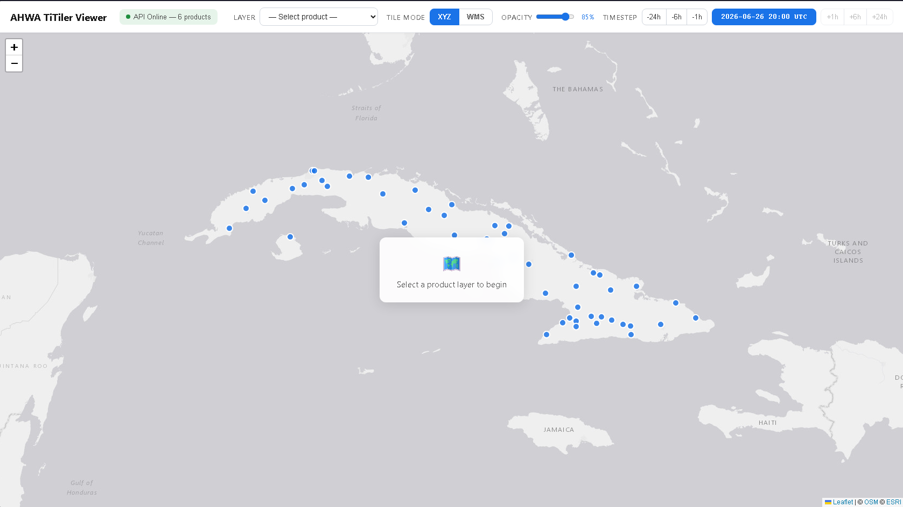
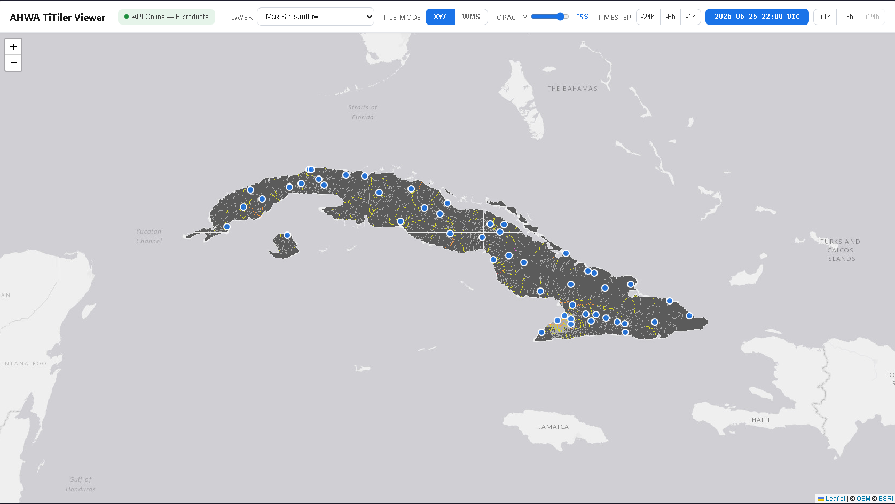
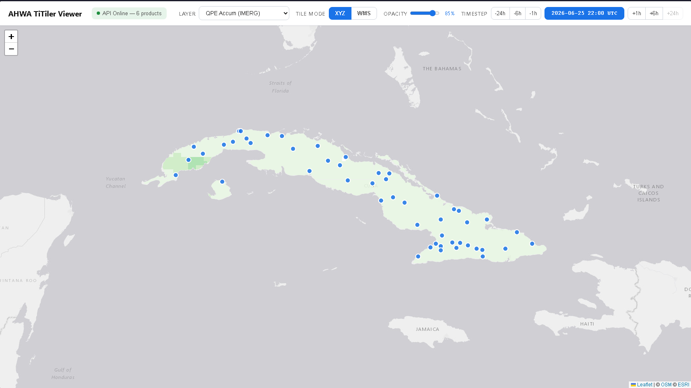
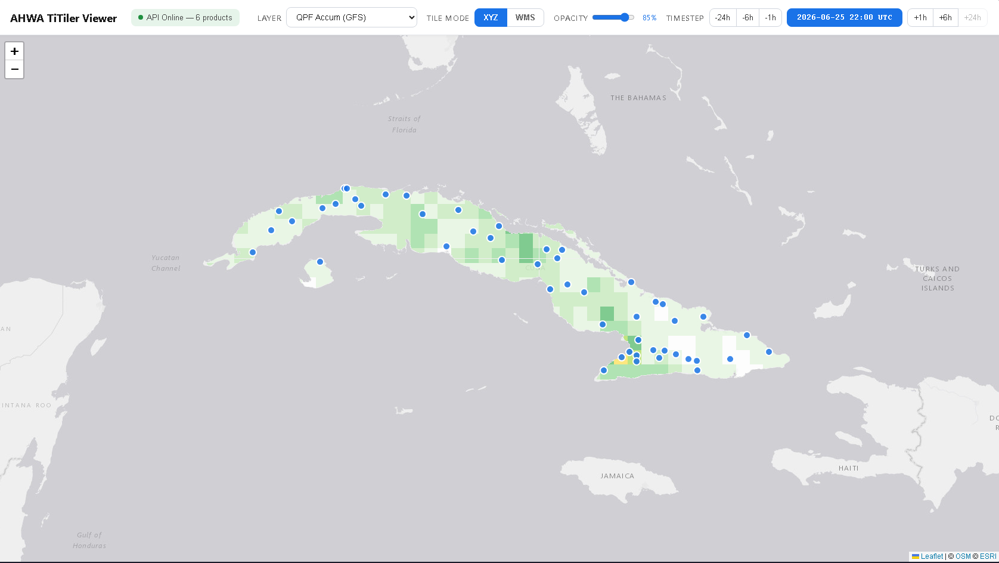
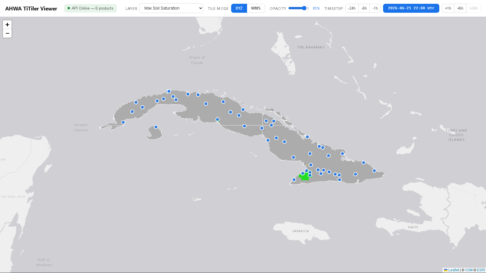
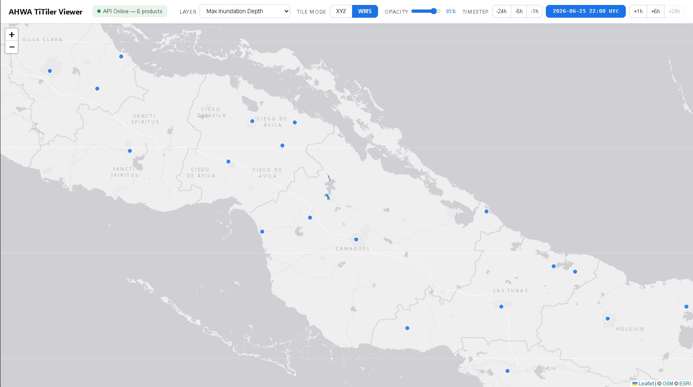
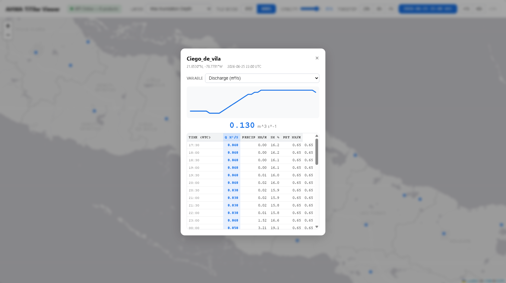

# Threading Inputs to Outputs (TITO)

English version: [README.en.md](README.en.md)

TITO es un marco de trabajo diseñado para ejecutar operativamente el modelo hidrológico EF5, integrando datos satelitales, técnicas de aprendizaje automático y productos de predicción numérica del tiempo para apoyar el pronóstico en tiempo real y el análisis hidrológico.

### Requisitos

TITO utiliza **Conda** como gestor de paquetes. Todas las dependencias de Python y del sistema están definidas en `tito_env.yml`. El script de instalación creará automáticamente el entorno Conda `tito_env` a partir de este archivo.

- **Gestor de paquetes:** Conda (Miniconda o Anaconda)
- **Entorno Python:** Definido en [`tito_env.yml`](tito_env.yml)
- **Paquetes principales:** numpy, scipy, pandas, gdal, rasterio, xarray, netcdf4, cfgrib, herbie-data, pytorch, entre otros

## Instrucciones de instalación
**1. Clonar el repositorio**
  ```sh
  git clone https://github.com/AHWALab/TITOCuba.git
  ```
**2. Ir a la carpeta del repositorio**
  ```sh
  cd TITOCuba/
  ```
**3. Ejecutar el script de configuración**
   Este paso puede tardar unos minutos.
  ```sh
  bash setup_tito.sh
  ```

**Nota:** El script de instalación descarga y extrae automáticamente todos los archivos de datos requeridos desde Zenodo (carpetas basic/, parameters/ y DA_Climatology/). Si prefiere hacerlo manualmente o si la descarga automática falla, siga los pasos a continuación:

<details>
<summary><b>Instrucciones para la descarga manual de datos (opcional)</b></summary>

**4. Preparar los archivos (método manual)**

- Los MDE de 25 m son de gran tamaño, por lo que se proporcionan en el siguiente [enlace de Zenodo](https://zenodo.org/records/17716930). Después de descargarlos, todos los archivos TIF deben extraerse en la carpeta `basic/`.
- Del mismo modo, los parámetros y los archivos CSV precalculados de asimilación de datos también se proporcionan en Zenodo. El archivo zip de parámetros debe extraerse en la carpeta `parameters/` y los datos de asimilación de datos deben extraerse en la carpeta `DA_Climatology/`.

</details>

**Nota:** Si el script de instalación no pudo configurar automáticamente la ruta del ejecutable de EF5, actualícela manualmente en `Cuba_config.py` en la siguiente variable:
`ef5Path = "put EF5 executable path here example - /home/naman/EF5/EF5LatestRelease/EF5/bin/ef5"`

Después de la instalación, asegúrese de que su carpeta de TITO contenga los siguientes subdirectorios y archivos.

## Estructura del repositorio

Este repositorio está diseñado para ejecutar EF5 de forma operativa sobre Cuba.

### Archivos y carpetas principales
- **`Cuba_config.py`** - Archivo de configuración para preparar la ejecución operativa.
- **`orchestrator.py`** - Script principal de Python que gestiona todo el flujo de trabajo.
- **`pipeline.sh`** - Script de Bash que activa el entorno Conda `tito_env` y ejecuta `orchestrator.py` usando la configuración de `Cuba_config.py`.

### Directorios de entrada y salida
- **`basic/`** - Contiene archivos DEM, FAC y FDIR.
- **`pet/`** - Contiene rejillas mensuales de PET (evapotranspiración potencial).
- **`parameters/`** - Contiene parámetros distribuidos para los modelos KW y CREST.
- **`states/`** - Almacena los archivos de estado del modelo generados durante las ejecuciones operativas.
- **`statesHighRes/`** - Almacena los estados generados en la ejecución de 1 km para usarlos en el modelo de 25 m.
- **`outputs/`** - Carpeta de salida donde se guardan los resultados de simulación.
- **`outputs_25m/`** - Carpeta de salida donde se guardan los resultados de simulación a 25 m.
- **`precip/`** - Aquí se descargan los archivos IMERG QPE; también se almacenan aquí los archivos de nowcast generados por el sistema de pronóstico inmediato.
- **`precipEF5/`** - Aquí se reformatean y copian los archivos basados en QPE y QPE_nowcast para que EF5 pueda ingerirlos.
- **`DA_Climatology/`** - Contiene datos promedio precalculados de embalses para asimilación de datos desde diciembre de 2025 hasta enero de 2031. Estos datos se usan cuando no se proporcionan observaciones manuales para los embalses.
- **`DA_Manual/`** - Almacena datos observados de embalses ingresados manualmente para la asimilación de datos. Si existen datos para el período de simulación actual, se usarán en lugar de los datos climatológicos.
- **`DA_Consolidated/`** - TITO crea automáticamente una lista consolidada de datos observados para todos los embalses seleccionando datos climatológicos precalculados o datos manuales. Este archivo se actualiza en cada ejecución.
- **`DA_Simulation/`** - TITO genera automáticamente archivos CSV individuales para cada embalse con datos observados correspondientes al período de simulación actual. Estos archivos se actualizan en cada ejecución.
- **`templates/`** - Almacena plantillas de archivos de control de EF5, que se actualizan dinámicamente en cada ejecución.
- **`qpf_store/`** - Almacena archivos QPF para utilizarlos en ejecuciones basadas en QPF.
- **`Nowcast/`** - Contiene rutinas de aprendizaje automático utilizadas para generar pronósticos QPF.
- **`tito_utils/`** - Colección de módulos utilitarios y scripts auxiliares usados internamente por TITO.

### Salidas de TITO

Cada simulación produce las siguientes salidas ráster (GeoTIFF):

- **Caudal unitario máximo** (m³/s/km²)
- **Caudal máximo** (m³/s)
- **Humedad máxima del suelo** (0–100 %)
- **QPE: Precipitación estimada acumulada** (vía IMERG + Nowcasting)
- **QPF: Precipitación pronosticada acumulada** (vía GFS)
- **Profundidad máxima: Inundación** (m)

Adicionalmente, se genera un archivo CSV de series de tiempo para cada simulación en cada punto de medición definido en `titiler_api/gaugePoints.txt`. Ejemplo de nombre de archivo:

```
ts.la_habana.crest.20260622.160000.csv
```

> **Nota:** Para información adicional sobre las líneas de tiempo y salidas de la simulación, consulte el documento **TITO Simulation and Outputs info.pptx**.

## ¿Cómo ejecutar TITO?
**1. Editar el archivo de configuración:**
Después de completar la instalación del entorno requerido y de poblar las carpetas correspondientes de EF5, abra el archivo `Cuba_config.py`. Hay algunas líneas que el usuario debe modificar en este archivo para ejecutar TITO correctamente:
- **ef5Path:** Asegúrese de que la ruta al ejecutable de EF5 esté correctamente definida. Si el script de instalación no la configuró automáticamente, actualice esta ruta con la correspondiente al binario de EF5 en su sistema.
- **HindCastMode:** Si va a ejecutar un evento ocurrido en el PASADO, defina `HindCastMode = True` y escriba la fecha de interés en `HindCastDate`, usando el formato "YYYY-MM-DD HH:MM". Si desea ejecutar TITO en modo nowcast (es decir, comenzando en el tiempo presente), defina `HindCastMode = False`.
- **run_LR:** Para incluir QPF en la simulación (las opciones son GFS o WRF), defina `run_LR = True`.
  - Si la simulación es para un **evento pasado** (`HindCastMode = True`), debe proporcionar:
    - Fecha de inicio del QPF (`StartLRtime`)
    - Fecha de fin del QPF (`EndLRtime`)
    - Paso de tiempo del QPF (`LR_timestep`) en minutos, por ejemplo `30u`
    - Ruta al archivo de QPF (`QPF_archive_path`)
  - Si activa esta opción para **operaciones en tiempo real**, TITO usa un horario QPF predefinido. Puede revisar `orchestrator.py` para personalizarlo según su conveniencia.
- **email_gpm:** Esta versión de TITO usa IMERG Early V07 como QPE. Necesitará crear una cuenta en el servidor de GPM para descargar archivos de precipitación. Visite la [página de registro de NASA GPM](https://registration.pps.eosdis.nasa.gov/registration/) y siga las instrucciones. **Importante:** Use su correo de registro como contraseña para que TITO pueda utilizarlo en las rutinas.

**Antes de ejecutar TITO, verifique las rutas de configuración:**

Abra `Cuba_config.py` y asegúrese de que las siguientes configuraciones sean correctas:

- **Directorios básicos de entrada:** Verifique que las carpetas esenciales de entrada estén correctamente pobladas:
  - `basic/` - Debe contener DEM para resoluciones de 1 km y 25 m
  - `pet/` - Debe contener rejillas mensuales de PET (evapotranspiración potencial)
  - `parameters/` - Debe contener parámetros distribuidos para los modelos KW y CREST del modelo de 1 km, y `parameters/highResPara/` debe contener los parámetros para los modelos KW y CREST del modelo de 25 m

- **Configuración de la reejecución EF5 de alta resolución:** Verifique que todas las rutas para la ejecución a resolución de 25 m estén correctamente configuradas:
  - `highres_template` - Ruta a la plantilla del archivo de control de alta resolución
  - `highres_maskgrid` - Ruta al archivo de la rejilla de máscara
  - `highres_gauge_list` - Ruta a la lista de estaciones
  - `highres_dataPath` - Carpeta de salida para los resultados a 25 m
  - `statesHighResPath` - Carpeta para los estados del modelo de alta resolución

- **Configuración de asimilación de datos (DA):** Verifique que todas las rutas de carpetas DA existan y sean correctas:
  - `DA_climatology_path` - Carpeta que contiene datos promedio precalculados de embalses
  - `DA_manual_path` - Carpeta para datos observados ingresados manualmente
  - `DA_consolidated_path` - Carpeta donde se crearán los datos consolidados
  - `DA_simulation_path` - Carpeta donde se generarán archivos CSV individuales por embalse
  - `DA_list_path` - Ruta a la lista de embalses para asimilación de datos

**2. Ejecutar TITO:**
  Ejecute la siguiente línea en la terminal:
  ```sh
  ./pipeline.sh
  ```

  Los registros del pipeline pueden verse en `data/logs/`.

**3. Programar TITO para que se ejecute automáticamente cada hora (opcional):**

  Puede usar el script `manage_cron.sh` para administrar fácilmente la tarea cron de TITO:

  - **Instalar la tarea cron:**
    ```sh
    ./manage_cron.sh install
    ```

  - **Comprobar el estado de la tarea cron:**
    ```sh
    ./manage_cron.sh status
    ```

  - **Eliminar la tarea cron:**
    ```sh
    ./manage_cron.sh remove
    ```

  Una vez instalada, TITO se ejecutará automáticamente cada hora en `hh:00`.

  <details>
  <summary><b>Configuración manual de cron (método alternativo)</b></summary>

  Si prefiere configurar la tarea cron manualmente:

  1. Abra el editor de crontab:
     ```sh
     crontab -e
     ```

  2. Añada esta línea al archivo y guárdelo:
     ```
     0 * * * * /home/naman/labWork/TITOCubaTest/pipeline.sh
     ```

  3. Verifique que la tarea cron esté instalada:
     ```sh
     crontab -l
     ```

  TITO ahora se ejecutará automáticamente cada hora en `hh:00`.

  </details>

**Nota sobre la ejecución del script de descarga de GFS:**

Se recomienda ejecutar por separado y en segundo plano el script de descarga de GFS, ya que las publicaciones de GFS suelen sufrir retrasos. En cada simulación, el script a veces no encuentra la publicación más reciente de GFS, por lo que vuelve a descargar el ciclo anterior, lo cual consume tiempo. El script de GFS ubicado en `tito_utils/qpf_utils/gfs_downloader.py` también permite ejecución en segundo plano y verificará automáticamente nuevas publicaciones para mantener actualizados los archivos de GFS.

Para ejecutar este script en segundo plano:

1. Dentro de la terminal en el directorio raíz de TITO, active el entorno Conda de TITO:
   ```sh
   conda activate tito_env
   ```

2. Ejecute este script con el siguiente comando para mantener actualizados los archivos más recientes de GFS:
   ```sh
   nohup python tito_utils/qpf_utils/gfs_downloader.py --auto-out /home/<user>/<tito root>/precip/GFS > /home/<user>/<tito root>/data/logs/gfs_downloader.log 2>&1 &
   ```

   Los registros del script pueden verse en `data/logs/gfs_downloader.log`.

## TITO + API TiTiler y aplicación web de prueba

TITO está equipado con un backend TiTiler para servir las salidas ráster de EF5, de modo que puedan superponerse en una aplicación web (por ejemplo, Tethys o el visor de prueba incluido). La API proporciona endpoints de teselas XYZ y WMS para los seis productos, además de un endpoint de series de tiempo/descarga para datos de estaciones.

**Una lista completa de todos los endpoints de la API está disponible en `titiler_api_endpoints.txt`.**

### Configuración de la API TiTiler

**1. Ejecutar el script de instalación y prueba**

```sh
cd titiler_api
bash setup_and_test.sh
```

Este script crea el entorno Conda `titiler-ahwa`, instala todas las dependencias de Python (FastAPI, rasterio, Pillow, numpy, uvicorn) y ejecuta una verificación rápida de que todos los directorios de productos existen y los archivos GeoTIFF pueden escanearse correctamente.

**2. Iniciar el servidor TiTiler**

```sh
./start.sh <número_de_puerto>
```

Ejemplo:

```sh
./start.sh 8080
```

Esto inicia TiTiler en el puerto 8080. Si no se especifica un puerto, se usará el puerto 8000 por defecto.

> **Nota:** El número de puerto debe coincidir con el puerto que espera su aplicación web (por ejemplo, Tethys).

**3. Actualizar TiTiler (después de cada simulación)**

El script `refresh_titiler.sh` renombra todas las salidas de EF5, las convierte a GeoTIFF optimizado para la nube (COG) y las coloca en los directorios de datos de TiTiler. Configure las rutas de origen y destino dentro de `refresh_titiler.sh`:

```sh
# Origen: directorios de salida del pipeline TITO
SRC_CREST="/var/ef5/TITOCuba/outputs/tmp_output_crest"
SRC_DEPTH="/var/ef5/TITOCuba/outputs_25m"

# Destino: TiTiler sirve directamente desde estos directorios de datos
DATA_ROOT="/var/ef5/geoServer"
```

**Emparejar con la tarea cron de TITO** para que se ejecute después de cada simulación:

```sh
./manage_cron.sh install titiler_api/refresh_titiler.sh
```

### Aplicación web de prueba (titiler_viewer) *(Opcional)*

Se incluye una aplicación web ligera basada en Svelte para probar los endpoints de TiTiler y visualizar las salidas.

**Requisitos previos:** Node.js 18+ y npm deben estar instalados.

**1. Configurar el visor**

```sh
cd titiler_viewer
bash setup.sh
```

Este script verifica Node.js/npm, instala todos los paquetes necesarios (Svelte, Vite, Leaflet) y verifica la estructura del proyecto.

**2. Iniciar TiTiler en el puerto 2000** (el visor espera el puerto 2000 por defecto)

```sh
cd titiler_api
./start.sh 2000
```

**3. Iniciar el visor**

```sh
cd titiler_viewer
npm run dev
```

El visor estará disponible en `http://localhost:3000`.









> **Nota:** Para información adicional sobre las líneas de tiempo y salidas de la simulación, consulte el documento **TITO Simulation and Outputs info.pptx**.

## Contacto
Puede comunicarse con Naman Mehta en naman-mehta@uiowa.edu, con Vanessa Robledo en vanessa-robledodelgado@uiowa.edu, o con el equipo de desarrollo del [Laboratorio AHWA](https://ahwa.lab.uiowa.edu/) en engr-ahwa-lab@uiowa.edu.

## Cómo citar este paquete
Robledo Delgado, V., & Vergara, H. (2025). Threading Inputs to Outputs (TITO) (v2.0.0). Zenodo. https://doi.org/10.5281/zenodo.17246491
